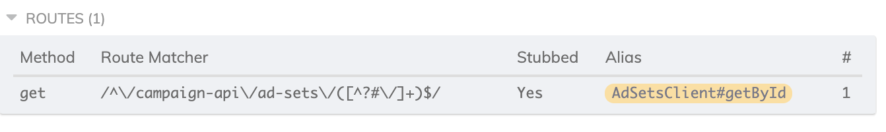

# Cypress typed stubs

A Criteo npm package to define **typed** Cypress stubs with **automatic** URL patterns,
based on clients generated with Swagger.

[](LICENSE)

`criteo/cypress-typed-stubs` introspects your typescript (Angular) clients generated
by [nswag](https://elanderson.net/2019/12/using-nswag-to-generate-angular-client-for-an-asp-net-core-3-api/)
and helps you define your own [Cypress](https://www.cypress.io/) stubs very easily, where:

- HTTP method
- URL pattern
- name

...are automatically generated.

And the fixture used to stub your API is **type checked**.

## Installation

Compatibility table:

| Angular version | Cypress version | cypress-typed-stubs version |
| --------------- | --------------- | --------------------------- |
| 11              | <9              | 2                           |
| 11              | 9               | 3.0.0-beta.4                |
| 13              | 9               | 4.0.0-beta.7                |
| 15              | 9               | 5.0.0                       |

```shell
npm install --save-dev cypress-typed-stubs
```

## Usage

> Have a look at the [`example-app`](example-app) code in this repository.

Let's assume that you have an [`AdSetsClient`](./example-app/src/client-generated-by-nswag.ts)
that was generated by nswag, which contains a `getById` endpoint and returns a `GetAdSetDetailsResponse` object,
or `null`.

```typescript
export class AdSetsClient extends GeneratedClient {
  getById(adSetId: number): Observable<GetAdSetDetailsResponse | null> {
    let url_ = this.baseUrl + '/campaign-api/ad-sets/{adSetId}';
    // ...
  }
}
```

### Without cypress-typed-stubs 😕

If you want to stub this endpoint in your Cypress tests, you might want to do something like:

```typescript
cy.intercept(
  'GET', // Need to know the HTTP method
  /.*\/campaign-api\/ad-sets\/.*/, // Need to "guess" the appropriate URL regex
  {
    // Need to maintain a JSON object that matches the proper interface
    adSet: {
      id: 5,
      // ...
      // No type checking!
      audienceType: 'invalid type',
    },
  }
).as('getAdSet'); // Need to define a name that makes sense and that is reused throughout the tests

// Can't easily reuse stubs
```

and wait on the call with:

```typescript
cy.wait('@getAdSet');
```

#### 👎 Issues

- the HTTP method and URL pattern have to be "guessed" and maintained if they happen to change in the generated client
- the provided fixture is **not type checked**
- a name has to be chosen and duplicated in the tests (prepended with `@`). No naming convention

### With cypress-typed-stubs 🤩

#### Create stubs

Define

- a **stub** that matches the generated client
  (ex: [`AdSetsStub`](./example-app/cypress/support/ad-sets.stub.ts))
- stub **endpoints** that match the generated client endpoint
  - the provided fixture is **type checked**
  - URL pattern and HTTP method are provided automatically

```typescript
export class AdSetsStub extends ClientStub<AdSetsClient> {
  constructor() {
    super(AdSetsClient);
  }

  endpoints = {
    getById: this.createEndpoint(
      this.client.getById,
      200,
      // Everything is typed!
      {
        adSet: {
          id: 5,
          // ... other properties
          audienceType: AudienceType.Custom,
        },
      }
    ),
  };
}
```

Instead of a fixture, you can provide a fixture builder: it is a function that takes a cypress request object ([CyHttpMessages.IncomingHttpRequest](https://github.com/cypress-io/cypress/blob/develop/packages/net-stubbing/lib/external-types.ts#L166C3-L198C4)) as parameter and returns a fixture.
It is useful to adapt the fixture depending on the request (for example, request body or query parameters):

```typescript
export class AdSetsStub extends ClientStub<AdSetsClient> {
  constructor() {
    super(AdSetsClient);
  }

  endpoints = {
    getById: this.createEndpoint(
      this.client.getById,
      200,
      // Fixture builder function -> builds the fixture depending on the request
      // (here depending on 'language' query parameter). The function is typed.
      (req) => (req.query['language'] === 'fr-FR' ?
        {
          adSet: {
            name: "Ceci est mon ensemble d'annonce",
            // ... other properties
          },
        } :
        {
          adSet: {
            name: 'This is my ad set',
            // ... other properties
          },
        }
      )
    ),
  };
}
```

#### Intercept

These **endpoints** can then be used in any Cypress test for intercept.

```typescript
// Create the stub _and initialize it_
const stub = new AdSetsStub().init();

// Endpoints
const getById = stub.endpoints.getById;

// Stub default config
EndpointHelper.stub(getById.defaultConfig());
```

Note that the usage of `EndpointHelper` is optional,
you can use `cy.intercept` directly

The endpoint is now stubbed by Cypress with a name automatically generated
(prefixed with client name for consistency):



#### Adjust

The stub can be adapted based on the default configuration:

- change HTTP status:

```typescript
EndpointHelper.stub(getById.defaultConfig().withStatusCode(500));
```

- adapt the fixture (mapping is type checked):

```typescript
EndpointHelper.stub(
  getById.defaultConfig().mappingFixture((fixture) => ({
    adSet: {
      ...fixture.adSet,
      id: 7, // Simply change the id
    },
  }))
);
```

If the endpoint was initially stubbed with a fixture builder,
the provided mapping function is applied to the result of the fixture builder function.

- replace the fixture entirely (override object is type checked):

```typescript
EndpointHelper.stub(
  getById.defaultConfig().withOverride({
    // Everything is typed!
    adSet: {
      id: 6,
      // ... other properties
      audienceType: AudienceType.Commerce,
    },
  })
);
```

If the endpoint was initially stubbed with a fixture builder,
the provided object overrides the result of the fixture builder function.

- set HTTP headers:

```typescript
EndpointHelper.stub(
  getById.defaultConfig().withHeaders({
    myHeader: 'myValue',
  })
);
```

- adaptations can be combined with fluent syntax:

```typescript
EndpointHelper.stub(getById.defaultConfig().withStatusCode(500).withOverride({}).withHeaders({ traceId: '12345' }));
```

#### Wait

Endpoints have a default alias that can be used to wait calls:

```typescript
cy.wait(getById.alias);
```

#### 👍 Advantages

- stub name, HTTP method, URL pattern are provided automatically
- stub alias is a property
- fixture is type checked (which enables code assistance)
- helper methods

## Contributions

Please use Node v16 and npm v8.

### Testing within a "host" project

From this project:

```shell
npm run prepare
# This will break the local build, but don't worry this is temporary
npm uninstall @angular/common
npm link
```

It is useful to temporarily uninstall `@angular/common` peer dependency to avoid incompatible errors in the "host"
project.

From the project using the library:

```shell
npm link cypress-typed-stubs
```

After you are done with your tests, make sure to **not** commit your changes to `package.json` (the removal of dev
dependencies)
